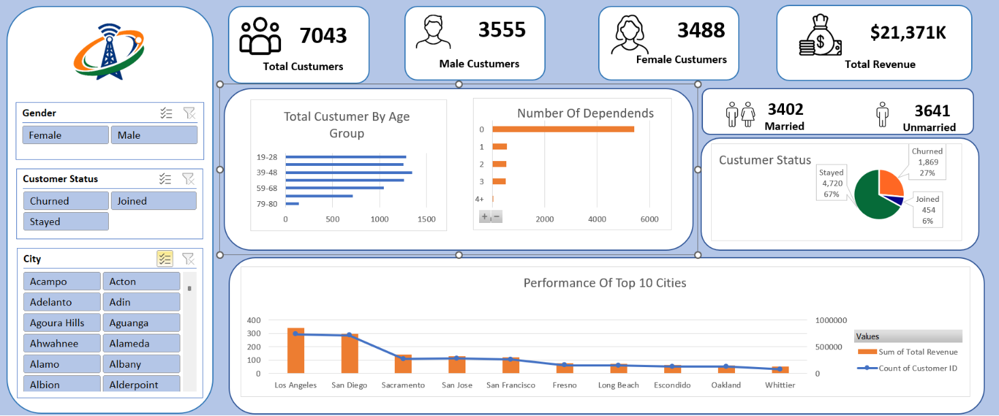
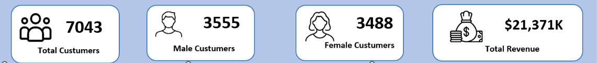
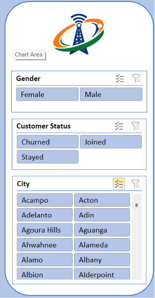
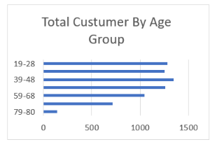
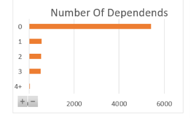
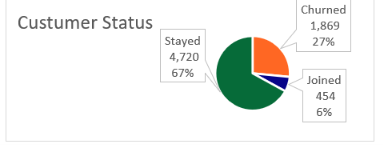
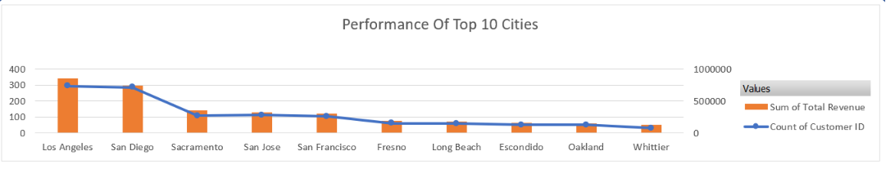

# 📊 Telecom Customer Analytics Dashboard (Microsoft Excel)

> An interactive Microsoft Excel dashboard built to analyze telecom customer demographics, revenue, customer behavior, and churn using Pivot Tables, Pivot Charts, Slicers, and KPI Cards.



---

## 📖 Project Overview

Telecommunication companies generate massive amounts of customer data every day. This project transforms raw customer information into an interactive business intelligence dashboard that enables stakeholders to monitor customer demographics, revenue, churn, and regional performance in real time.

The dashboard is fully interactive and allows users to filter insights using Excel slicers, making it easy to explore different customer segments without writing formulas or SQL queries.

---

# 🎯 Objectives

- Analyze customer demographics
- Monitor customer churn and retention
- Track business revenue
- Compare male and female customer distribution
- Identify top-performing cities
- Analyze customer dependency patterns
- Build an interactive dashboard using Microsoft Excel

---

# 📂 Dataset Information

The dashboard uses a telecom customer dataset containing **7,043 customer records**.

### Dataset Features

| Category | Attributes |
|-----------|------------|
| Customer Information | Customer ID, Gender, Age |
| Location | City, Zip Code, Latitude, Longitude |
| Family Details | Married, Dependents, Referrals |
| Services | Phone Service, Internet Service, Internet Type |
| Subscription | Contract, Offer, Tenure |
| Billing | Monthly Charge, Total Charges, Total Revenue |
| Payment | Paperless Billing, Payment Method |
| Customer Status | Stayed, Joined, Churned |
| Churn Details | Churn Category, Churn Reason |

---

# 📊 Dashboard Overview

The dashboard consists of multiple analytical sections designed to provide a complete overview of customer behavior.

---

# 📌 KPI Dashboard

Displays the most important business metrics at a glance.

### KPIs Included

- 👥 Total Customers
- 👨 Male Customers
- 👩 Female Customers
- 💰 Total Revenue
- 💍 Married Customers
- 🧍 Unmarried Customers

### Screenshot



---

# 🎛 Interactive Slicers

The dashboard provides dynamic filtering through Excel slicers.

Users can instantly filter the dashboard using:

- Gender
- Customer Status
- City

### Screenshot



---

# 👥 Customer Age Distribution

This visualization shows the distribution of customers across different age groups, helping identify the largest customer segments.

### Insights

- Young Adult Customers
- Middle Age Customers
- Senior Customers

### Screenshot



---

# 👨‍👩‍👧 Number of Dependents

Shows how customers are distributed based on the number of dependents.

This analysis helps understand household size and customer family demographics.

### Screenshot



---

# 🔄 Customer Status Analysis

A pie chart showing customer retention and churn.

The dashboard categorizes customers into:

- Stayed
- Joined
- Churned

This visualization provides a quick understanding of customer retention performance.

### Screenshot



---

# 🏙 Top 10 Cities Performance

A combination chart displaying:

- Revenue generated by city
- Customer count by city

This helps identify the most profitable customer locations.

### Screenshot



---

# 📈 Business Questions Answered

This dashboard helps answer questions such as:

- How many customers does the company currently have?
- What is the total business revenue?
- Which gender has more customers?
- How many customers are married?
- What percentage of customers have churned?
- Which cities generate the highest revenue?
- Which age group contributes the largest customer base?
- How many customers have dependents?

---

# 🛠 Tools & Technologies

- Microsoft Excel
- Pivot Tables
- Pivot Charts
- Slicers
- KPI Cards
- Conditional Formatting
- Data Cleaning
- Data Visualization

---

# 📁 Project Structure

```
Telecom-Customer-Analytics-Dashboard/
│
├── Telecom Dashboard.xlsx
├── README.md
├── Dataset.csv
│
├── images/
│   ├── dashboard.png
│   ├── kpi_cards.png
│   ├── slicers.png
│   ├── age_group.png
│   ├── dependents.png
│   ├── customer_status.png
│   ├── top_cities.png
│   └── dataset_preview.png
│
└── LICENSE
```

---

# 📋 Sample Dataset

| Customer ID | Gender | Age | Married | City | Contract | Monthly Charge | Total Revenue | Customer Status |
|-------------|--------|-----|----------|------|-----------|----------------|---------------|-----------------|
| 0002-ORFBO | Female | 37 | Yes | Frazier Park | One Year | 65.60 | 974.81 | Stayed |
| 0003-MKNFE | Male | 46 | No | Glendale | Month-to-Month | -4.00 | 610.28 | Stayed |
| 0004-TLHLJ | Male | 50 | No | Costa Mesa | Month-to-Month | 73.90 | 415.45 | Churned |
| 0011-IGKFF | Male | 78 | Yes | Martinez | Month-to-Month | 98.00 | 1599.51 | Churned |

---

# 📌 Key Insights

- Total Customers: **7,043**
- Total Revenue: **$21.37 Million**
- Nearly equal distribution between male and female customers.
- Majority of customers have **no dependents**.
- Most customers are retained, while a smaller percentage have churned.
- Los Angeles and San Diego contribute the highest revenue among the top cities.

---

# 💡 Skills Demonstrated

- Dashboard Design
- Business Intelligence
- Interactive Reporting
- Data Cleaning
- Data Visualization
- Pivot Tables
- Pivot Charts
- Slicer Integration
- KPI Development
- Analytical Thinking

---

# 🚀 Future Enhancements

- Power Query integration
- Power Pivot data model
- Dynamic timeline filters
- Customer Lifetime Value (CLV) analysis
- Monthly revenue trend analysis
- Churn prediction using Machine Learning
- Geographic heat maps
- Automated dashboard refresh

---

# ⭐ If you like this project

If you found this project useful or learned something from it, consider giving the repository a **Star ⭐**.

It helps others discover the project and supports my work.

---

## 👨‍💻 Author

**Pratap singh**

**GitHub:** *Add your GitHub profile here*

**LinkedIn:** *Add your LinkedIn profile here*
